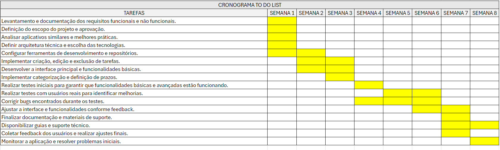

##  TO DO LIST

### ESCOPO:
- O objetivo do projeto é desenvolver uma aplicação web usando React e Node.Js de To-Do List que permita aos usuários criar, visualizar, editar e excluir tarefas. Afim que possa ser utilizada por seus colaboradores, ajudando os usuários a organizar suas tarefas de forma eficiente e segura.

### OBJETIVOS: 
-- Específicos:
- Desenvolver uma aplicação de To-Do List para a Escola SENAI que permita aos colaboradores organizar suas tarefas diárias de maneira eficiente, com recursos de segurança de dados e integração com outros sistemas da escola.

-- Mensuráveis:
- A aplicação deve permitir a criação, edição, e exclusão de tarefas.
- A funcionalidade deve incluir a definição de prazos e categorias para tarefas.

-- Atingíveis:
- Utilizar frameworks e bibliotecas bem documentadas para assegurar o cumprimento dos prazos e qualidade do código.

-- Relevantes:
- O sistema deve melhorar a produtividade dos colaboradores em pelo menos 20%, medido por uma pesquisa de satisfação e análise de tempo gasto em tarefas.

### CRONOGRAMA:

### RECURSOS:
- React Framework
- Node.js
- MongoDB Database
- Visual Studio Code
- Excel (cronograma)
- Miro (diagramas)
- Git/GitHub
- Equipe (Gerente de Projeto,Desenvolvedores Backend (2-3 membros),Desenvolvedores Frontend (2 membros),Designer UX/UI,Tester/QA (Controle de Qualidade))

### ANÁLISE DE RISCO:
- Atrasos no Cronograma devido a Requisitos Não Previstos:
- Mitigação: Realizar uma análise detalhada dos requisitos e envolver todas as partes interessadas desde o início. Adotar uma metodologia ágil (como Scrum) para permitir ajustes contínuos e flexibilidade no planejamento.
- Problemas Técnicos com Internet:
-  Mitigação: Garantir que todos os membros da equipe tenham uma conexão de internet estável e fornecer alternativas de trabalho offline quando possível.
- Falta de Experiência da Equipe com as Ferramentas e Tecnologias Utilizadas:
-  Mitigação: Investir em treinamentos e recursos de aprendizado para a equipe. Estabelecer um plano de desenvolvimento contínuo e promover a troca de conhecimentos e boas práticas entre os membros da equipe.
- Mudanças nos Requisitos do Projeto:
-  Mitigação: Um escopo claro ajuda a estabelecer expectativas realistas e a minimizar mudanças inesperadas, facilitando o controle de alterações.

